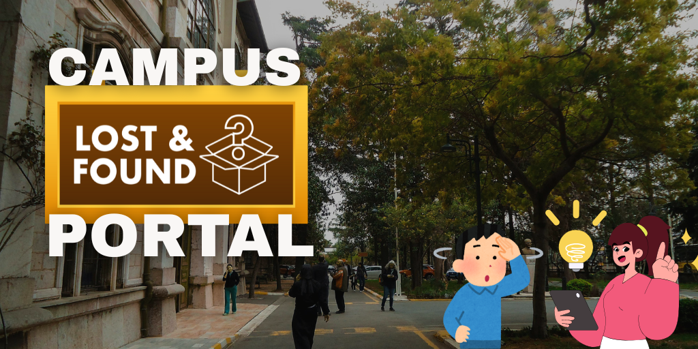
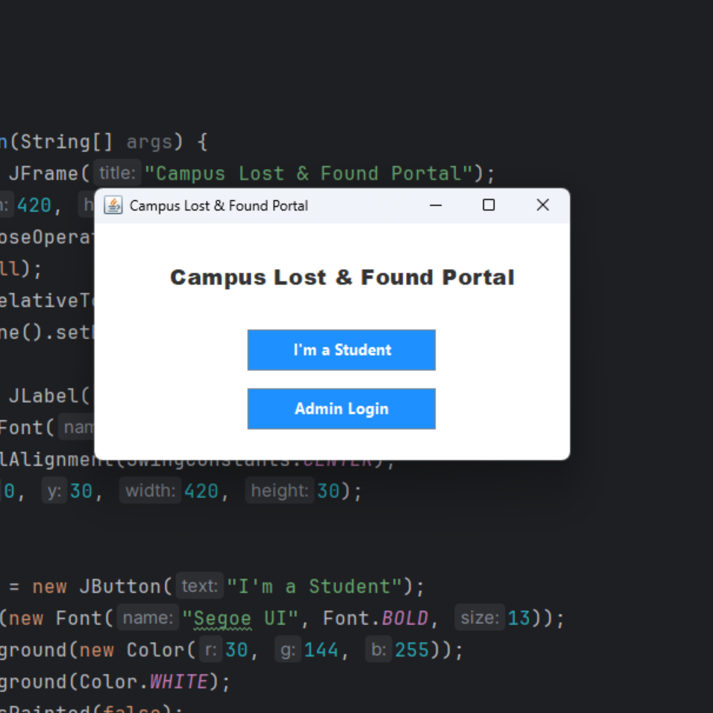
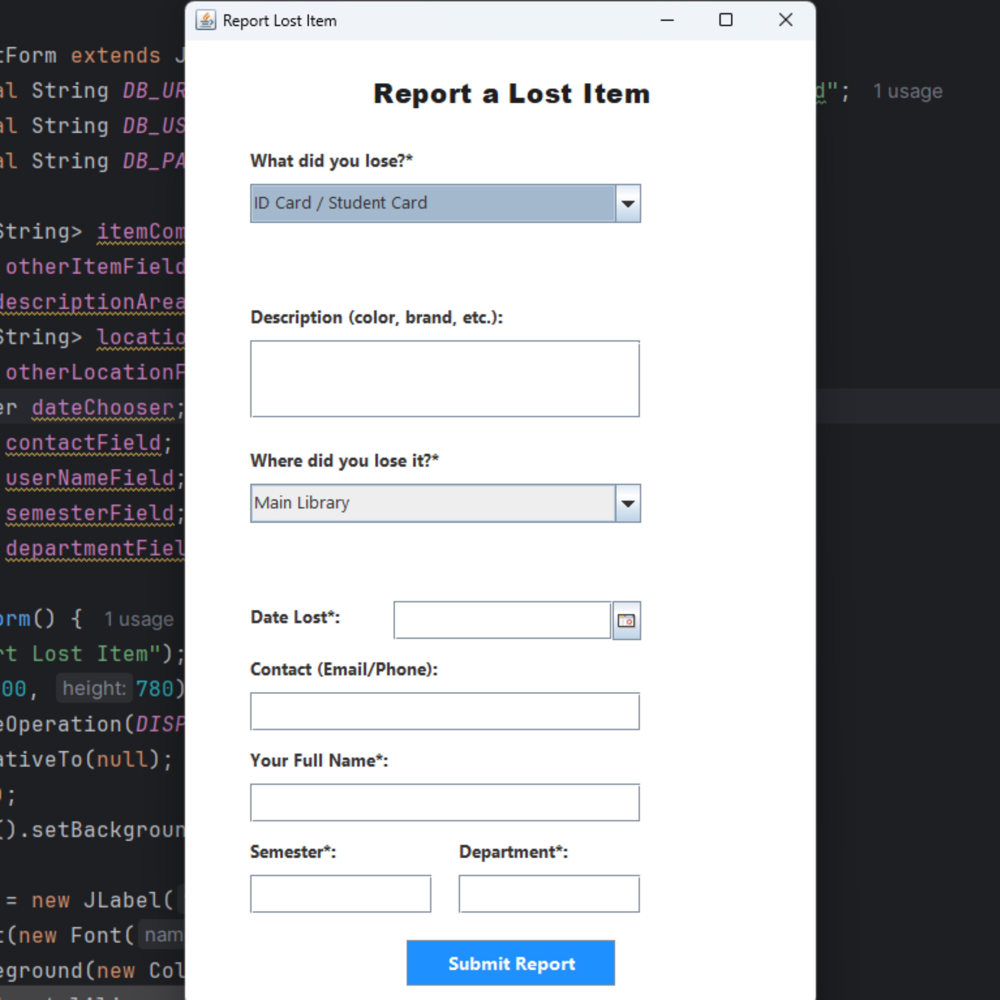
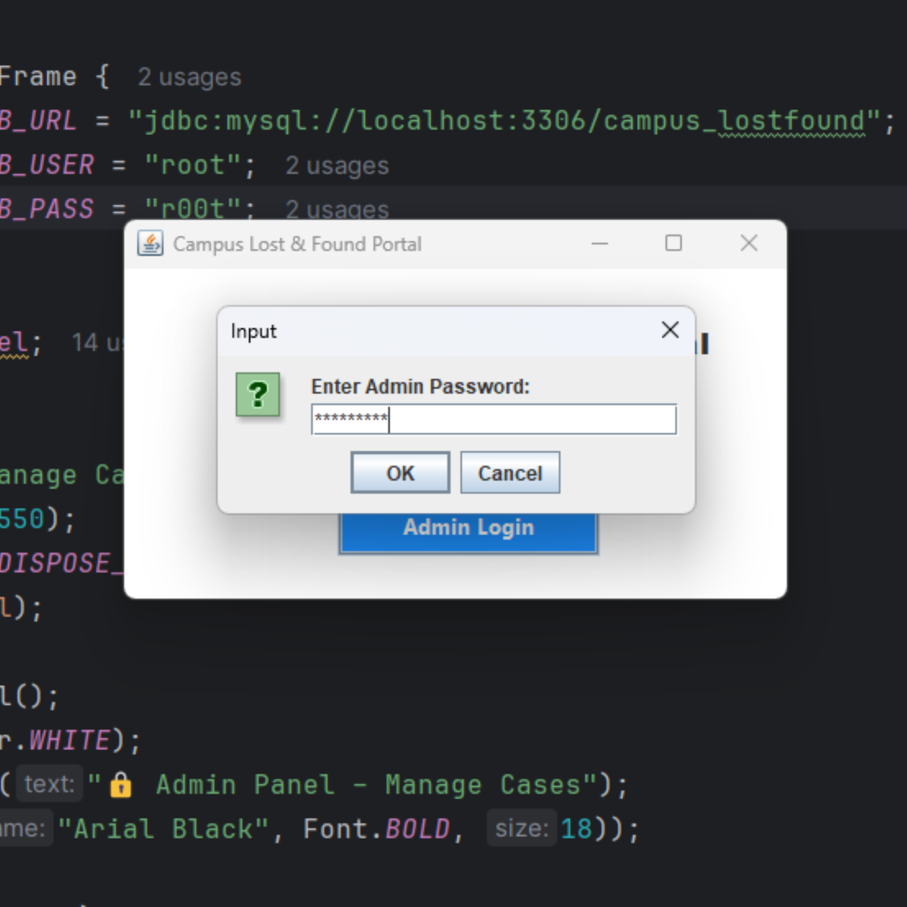

<!-- Hero Banner -->

  

# 🏫 Campus Lost & Found Portal

> A clean, secure, and campus-tailored desktop app that helps students report and recover lost items — no more messy notice boards!

Built with **Java Swing + MySQL** ,Solution for the biggest campus challenge.

---

## 🌟 Key Features

| Feature | Description |
|--------|-------------|
| 🗂️ **Report Lost/Found Items** | Easy forms with category dropdowns, calendar date picker, and location selection |
| 🔐 **Admin Power Panel** | Double-click any row to edit ALL fields — not just status! |
| 📍 **Campus-Tailored Design** | Real locations (Library, CS Lab, Cafeteria), departments, semesters |
| 🛡️ **Secure Login** | Password masking (••••) and role-based access |
| 🔄 **Smart Search & Filter** | Find items by name, location, or status instantly |
| 🎨 **Modern UI** | Clean typography, bold headings, and intuitive layout |

---

## 📸 Screenshots

  
  
  

---

## ▶️ How to Run (3 Simple Steps)

1. **Install Java 17+**  
   Download from [Oracle](https://www.oracle.com/java/technologies/downloads/) or [Adoptium](https://adoptium.net/)

2. **Set Up MySQL**  
   - Create database: `CREATE DATABASE campus_lostfound;`  
   - Run schema (see `schema.sql`)

3. **Run the App**  
   - Add `mysql-connector-j-8.0.33.jar` and `jcalendar-1.4.jar` to classpath  
   - Run `CampusLostFoundApp.java`

---

## 🚀 Future Vision

This isn’t just a semester project — it’s a foundation for something bigger:

- 📱 **Mobile App Version** (Android/iOS)
- 📬 **Email/SMS Notifications** when an item is matched
- 🖨️ **QR Code Receipts** for submitted reports
- 📊 **Dashboard Analytics** — “Top 5 Lost Items This Month”

---

## 📄 License

MIT License — feel free to use, modify, and share!

---

## ⚙️ Made With

- Java
- MySQL
- Swing GUI
- JCalendar
- Love for campus problem-solving 😊

---
## 🧑‍💻 Author

Rinshad 

linkedin [www.linkedin.com/in/rinshad-huzain-297625269](#)
